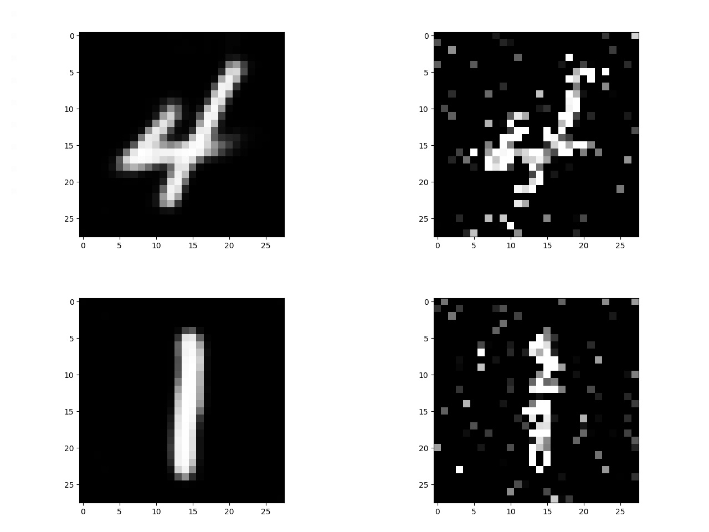
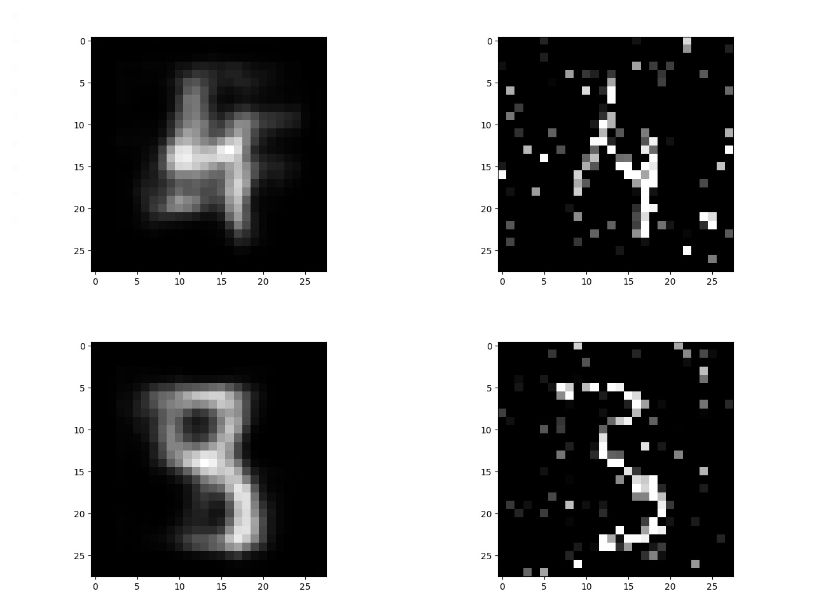
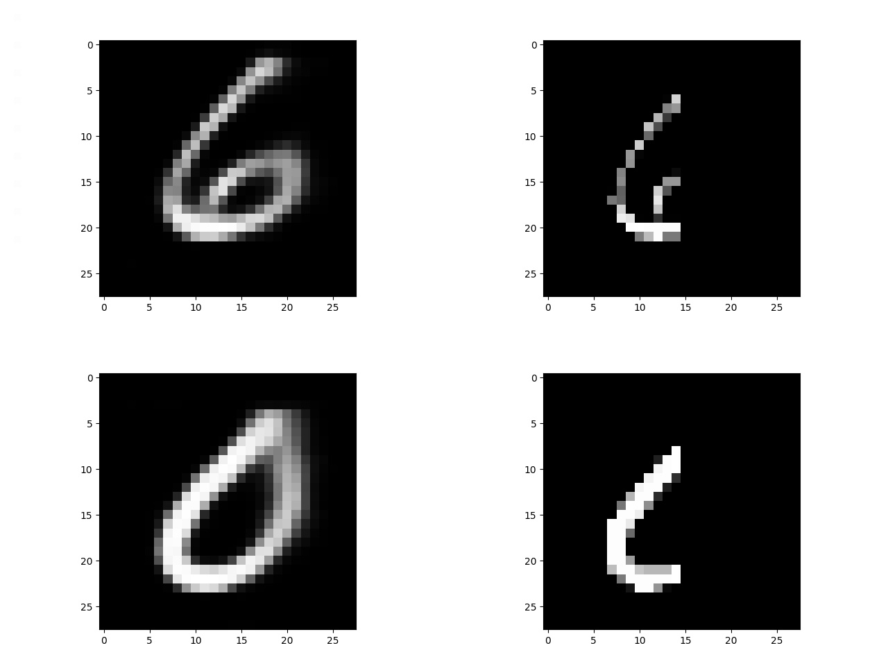
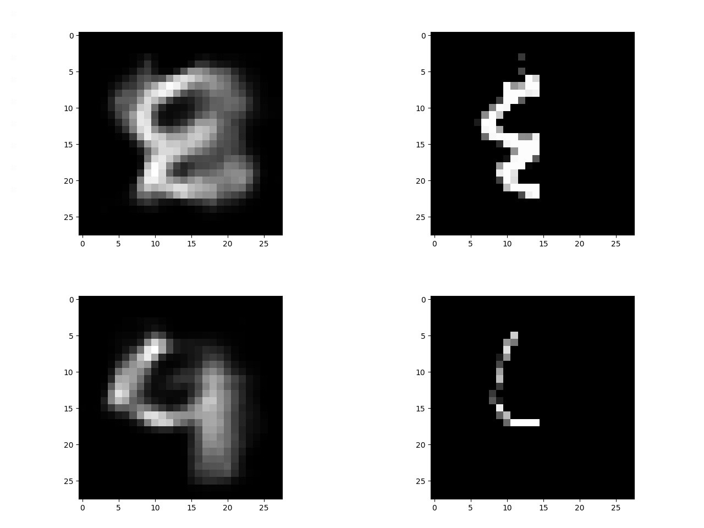

# Image-Priors-and-Reconstructions
 
 (1) - regular Auto Encoder 
 (4) - Auto-Encoder that was trained with an additional loss term that represents the
        DKL loss between the latent space and the normal distribution
 
 We added two types of curruptions to images: Gaussian Noise and In-paint mask on the right half of the image
We trained both sections (1), (4)’s Networks with MNIST distributions.  Where the 4’th section’sNetwork was trained
by adding element to the loss function forces the latent space to narrow downto be normal distribution. By  comparing
both  networks  performances  we  can  say  that  (1)  section  network  had  better  re-sults comparing the 4’th section,
and that’s because adding the normal distribution’s restrictionwhile training the (4)’s network on the original distribution
images makes noised/in-painted im-ages less part of the original distribution and thus they have less chances to be mapped
to normal distribution in latent space and be well-reconstructed.

## examples:
denoising test of network (1):

denoising test of network (4):

in-paint mask test of network (1):

in-paint mask test of network (4):

